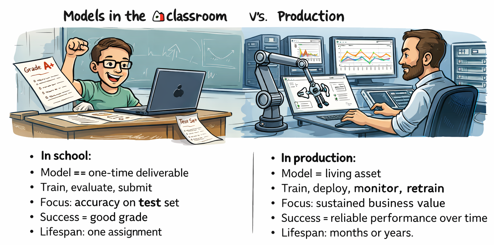
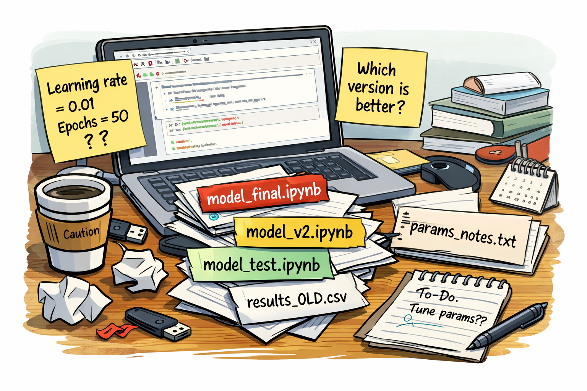
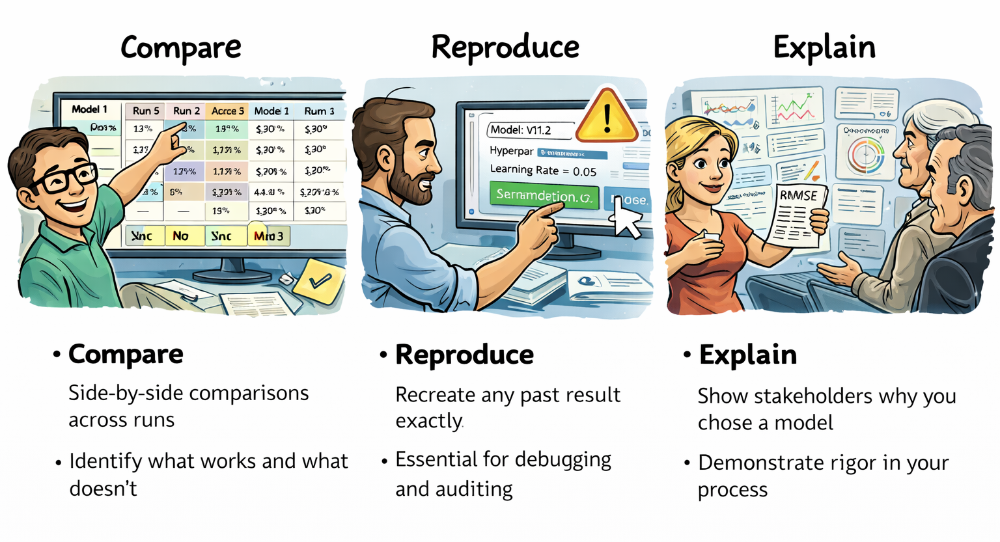
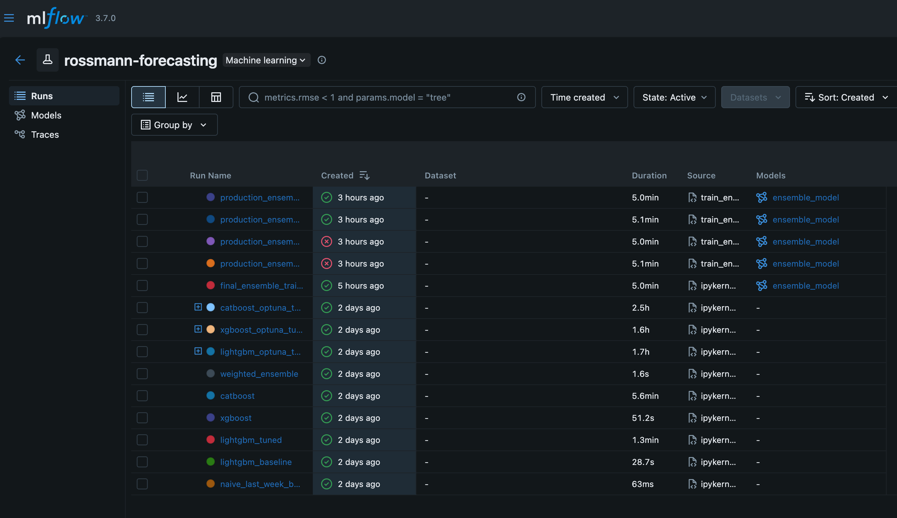
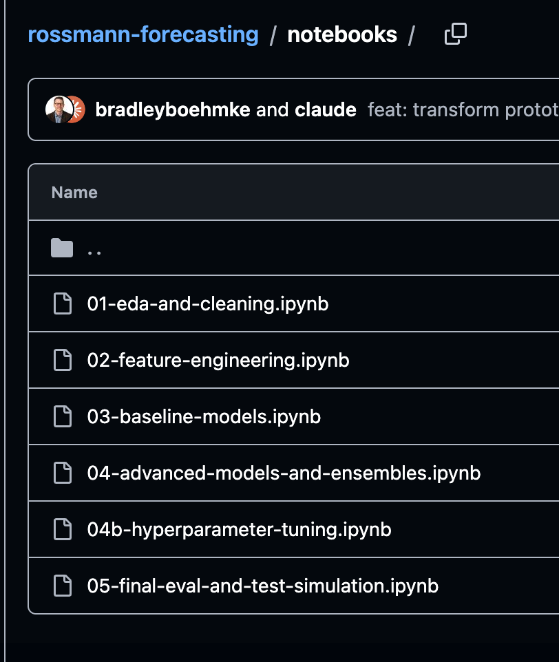

# Welcome {background="#43464B"}

## Applied Workshops Series {background-image="assets/images/bridge.jpg" background-size="cover" background-position="center"}

**Bridging the gap between classroom and industry**

<br><br><br><br><br><br><br><br>
[This series shares best practices and industry standards not always covered in coursework --- practical skills that can differentiate you early in your career.]{style="color: white;"}

::: {.notes}
Frame this as part of the applied workshop series. These workshops focus on practical skills that matter in industry but are often underrepresented in coursework. Today we move from data pipelines into the modeling lifecycle.
:::

## Today's Agenda

* ModelOps overview
* Structured experimentation
* Experiment tracking with MLflow
* Rossmann project walkthrough
* Live demo
* Wrap-up

<br>

::: {.callout-tip}
## Today's Goal
Walk out understanding how to move from ad-hoc training runs to structured, trackable model experimentation.
:::

::: {.notes}
Set expectations: this is practical and hands-on. We'll start with concepts, ground them in a real project, and then see it live in MLflow. The goal is a mental model you can apply to your own work immediately.
:::

# The Problem {background="#43464B"}

## Models in the Classroom vs. Production

::: {style="text-align: center;"}
{width=90%}
:::

::: {.callout-important}
## The Gap
Academic projects treat models as artifacts. Industry treats them as **lifecycle assets** that need continuous management.
:::

::: {.notes}
- Start by surfacing the fundamental mindset shift students need to make
- Walk through the visual contrast on screen:
  - **In school**: Model = one-time deliverable. Train, evaluate, submit. Focus on accuracy. Success = good grade. Lifespan = one assignment
  - **In production**: Model = living asset. Train, deploy, monitor, retrain. Focus on sustained business value. Success = reliable performance over time. Lifespan = months or years
- The skills that get you a good grade (feature engineering, tuning, accuracy) are necessary but not sufficient
- Production adds critical questions: Can you reproduce this? Can others use it? Does it still work next month? Can you explain decisions?
- This isn't a criticism of academic work --- it's recognizing that the success criteria are fundamentally different
- This gap is what ModelOps addresses --- today we start with the foundation: experiment tracking
:::

# ModelOps {background="#43464B"}

## Why ModelOps Matters {.smaller}

**Questions that haunt production ML teams:**

* "Which model version is in production?"
* "What hyperparameters did we use?"
* "Can you reproduce last quarter's results?"
* "Why did performance drop?"

. . .

<br>

::: {.callout-important}
## The Root Problem
Most teams focus on training accuracy but neglect **reproducibility, versioning, deployment, and monitoring** --- the foundation for production ML systems.
:::

. . .

**The solution:** Manage models as **lifecycle assets**, not just training artifacts.

::: {.notes}
- Start with the pain --- these are real questions that come up in industry constantly
- Without systematic practices, the answers are often "I'm not sure" or "let me dig through old notebooks"
- In school, the finish line is model accuracy. In industry, that's the starting line
- The problem: teams build models but can't reproduce them, deploy them confidently, or maintain them over time
- This slide hooks students with the problem before introducing ModelOps as the solution
- The last line sets up the next slide: "What does it mean to manage models as lifecycle assets?"
:::

## What Is ModelOps? {.smaller}

::: {.callout-note}
## ModelOps
Management of the lifecycle of machine learning models
:::

<br>

```{mermaid}
%%| fig-width: 9
flowchart RL
    subgraph dt[DataOps]
    direction LR
    end
    subgraph ml[ModelOps]
    direction LR
    m1[Model Experimentation]
    m2[Model Versioning]
    m3[Model Deployment]
    m4[Model Monitoring]
    m1 --> m2 --> m3 --> m4 --> m1
    end
    dt --> ml --> dt
```

::: {.notes}
- ModelOps is the discipline of managing models throughout their entire lifecycle
- The lifecycle is a cycle: experimentation → versioning → deployment → monitoring → back to experimentation
- Note how this connects to DataOps --- reliable models depend on reliable data pipelines
- Each stage feeds into the next, and monitoring in production informs future experiments
- Most people think "ML" means training a model. That's only one piece of a much larger system
- Today we focus on the first stage: experimentation and tracking
- Let's break down what each stage actually does...
:::

## The Four Stages of ModelOps {.smaller}

::: {.incremental}
- **Model Experimentation**
  Track parameters, metrics, and artifacts to enable reproducible, comparable training runs. *Foundation for everything else.*

- **Model Versioning**
  Ensure transparency regarding model lineage --- know exactly what data, code, and hyperparameters produced each model version.

- **Model Deployment**
  Bridge the gap between experimentation and real-world application, ensuring models deliver value in production environments.

- **Model Monitoring**
  Continuously track model behavior in production to identify performance degradation and trigger retraining when needed.
:::

::: {.notes}
- Now we go deeper into each stage of the lifecycle
- **Experimentation**: This is today's focus. Without tracking, you can't compare runs, reproduce results, or build systematically
- **Versioning**: Every model needs a lineage --- what data version, what code commit, what hyperparameters. This is how you answer "can you reproduce last quarter's model?"
- **Deployment**: Getting a model into production is its own discipline --- APIs, containers, scaling, rollback strategies
- **Monitoring**: Models degrade over time as data distributions shift. Monitoring catches this and signals when retraining is needed
- The cycle repeats: monitoring insights feed back into new experiments, improved models get versioned and deployed
- These stages build on each other --- you can't version what you haven't tracked, can't deploy what you haven't versioned, can't monitor effectively without knowing what you deployed
:::

## Why These Stages Matter in Industry {.smaller}

::: {.incremental}
- **Scalability**: Standardizes workflows for deploying and managing multiple models across various environments.

- **Reproducibility**: Provides an audit trail of datasets, code, hyperparameters, and model versions throughout the lifecycle.

- **Collaboration**: Creates a structured framework that promotes transparency and knowledge sharing across teams.

- **Reliability**: Ensures models maintain performance over time, not just at initial deployment.

- **Regulatory Compliance**: Delivers the transparency and traceability needed to meet legal and ethical standards.
:::

::: {.notes}
- Now tie it to industry context --- why do organizations invest in ModelOps?
- **Scalability**: Think about managing 10, 50, or 100+ models. Without standardization, it becomes chaos
- **Reproducibility**: Critical for auditing, debugging, and regulatory requirements. In finance and healthcare, you must be able to recreate any model decision
- **Collaboration**: Multiple data scientists working together need consistent practices. ModelOps provides that structure
- **Reliability**: Models degrade over time as data distributions shift. The monitoring stage catches this
- **Compliance**: Regulated industries (finance, healthcare, insurance) must explain and justify model decisions. Full lifecycle tracking makes this possible
- This isn't overhead --- it's how professional data science works at scale
:::

## ModelOps Challenges {.smaller}

<br>

::: {.callout-warning}
## The Reality
ModelOps requires investment and discipline. Common challenges include:
:::

::: {.incremental}
- **Integration Complexity**: Interoperability between the myriad tools and systems used throughout the ML lifecycle.
- **Infrastructure Costs**: The cost of scaling infrastructure to meet these demands can be prohibitive for many organizations.
- **Team Expertise**: Requires cross-functional skills and expertise in data science, software engineering, and DevOps.
- **Evolving Standards**: New tools, techniques, and best practices emerge frequently, requiring organizations to adapt continuously.
:::

::: {.notes}
- Be honest about the challenges --- ModelOps isn't free
- Integration: most orgs have existing data pipelines, deployment systems, monitoring tools --- making them work together is hard
- Infrastructure: running experiment tracking servers, model registries, monitoring systems costs money and maintenance
- Team expertise: you need people who understand both the data science and the engineering
- Evolving standards: the landscape changes constantly --- what's best practice today might be outdated in a year
- But here's the key: you can start small. Today we focus on experiment tracking --- something you can adopt with minimal infrastructure
:::

# Experimentation {background="#43464B"}

## How Do You Track Experiments Today? {.smaller}

::: {.columns}
::: {.column width="50%"}
**Typical workflow:**

* Train a model in a notebook
* Tweak some parameters
* Rerun the cell
* Rename the notebook (`model_v2_final_FINAL.ipynb`)
* Copy-paste results into a spreadsheet
* Comment out old code
* Try to remember what worked
:::
::: {.column width="50%"}

:::
:::

<br>

::: {.callout-warning}
## Sound familiar?
Most of us have been here. It works for small projects, but doesn't scale. In industry, it's not uncommon to try tens, hundreds, or even **thousands** of experiments!
:::

::: {.notes}
- Ask students directly: "How do you keep track of your model experiments right now?"
- Let a few people answer --- you'll hear things like "I rename notebooks", "I keep a spreadsheet", "I just remember"
- Show of hands: "Who has a file called something_final_v2 or model_FINAL_REALLY_FINAL?"
- Don't judge --- make it relatable. Everyone starts here. This is the natural first approach
- But without structure, you lose track of what works, what changed, and how to reproduce results
- The goal of this slide is to surface the tactical pain before offering the solution
- Transition: let's talk about what specifically goes wrong with this approach
:::

## The Problems {.smaller}

::: {.columns}
::: {.column width="33%"}
**Which run was best?**

You trained 15 models. Three weeks later, which one had the best performance?

Where are those hyperparameters?
:::
::: {.column width="33%"}
**What changed?**

You improved RMSE by 12%. Was it the feature engineering? The learning rate? The data split?

You don't know.
:::
::: {.column width="34%"}
**Can you reproduce it?**

Your manager asks you to rerun last month's best model.

Can you recreate the exact same result?
:::
:::

::: {style="text-align: center;"}
{width=100%}
:::

::: {.notes}
- Walk through each problem concretely
- "Which run was best?" --- when you have a dozen notebooks with different experiments, finding the best one becomes archaeology
- "What changed?" --- without logging, you can't attribute improvement to a specific change
- "Can you reproduce?" --- this is the killer. If you can't reproduce results, you can't trust them, deploy them, or build on them
- These problems compound as teams grow and projects mature
:::

## Good Modeling = Structured Experimentation

::: {.callout-important}
## The Principle
Treat each training run as a **trackable experiment**, not a throwaway cell execution.
:::

<br>

Every experiment should capture:

* What you tried (parameters, algorithm, data & features used)
* What happened (metrics, performance)
* What you produced (model artifacts)

::: {.notes}
- This is the core mindset shift
- A notebook cell execution is ephemeral --- an experiment is a permanent record
- Structured experimentation doesn't mean more work --- it means the right work
- Think of it like a lab notebook in science: you record what you did so others (and future you) can understand and reproduce it
:::

## What to Track {.smaller}

```{mermaid}
%%| fig-width: 12
flowchart LR
    A["<b>Parameters</b><br/>Learning rate<br/>Max depth<br/>Algorithm"] --> E[Experiment Run]
    B["<b>Data & Features</b><br/>Dataset version<br/>Feature engineering<br/>Train/test splits"] --> E
    C["<b>Metrics</b><br/>RMSE, MAE, R²<br/>Per-fold CV scores"] --> E
    D["<b>Artifacts</b><br/>Trained model<br/>Predictions<br/>Feature importance"] --> E
    E --> F["<b>Tracked Record</b><br/>Reproducible<br/>Comparable<br/>Shareable"]
```

::: {.notes}
- Four categories of things to track for every experiment run
- **Parameters**: hyperparameters that control the algorithm --- learning rate, max depth, regularization
- **Data & Features**: what data you used --- dataset version, feature engineering steps, train/test/validation splits. Critical for reproducibility
- **Metrics**: the results --- RMSE, MAE, accuracy, per-fold cross-validation scores
- **Artifacts**: the outputs --- the trained model file, predictions CSV, feature importance plots
- Together, these create a complete record that can be compared, reproduced, and shared
:::

## Why Structure Matters

::: {style="text-align: center;"}
{width=90%}
:::

::: {.notes}
- Walk through the three benefits shown in the visual:
- **Compare**: when you have 100 hyperparameter trials logged, you can sort by metric and instantly find the best configuration. Side-by-side comparison across runs helps identify what works and what doesn't
- **Reproduce**: if a model in production degrades, you can go back to the exact experiment that produced it and understand what's different. Essential for debugging and auditing
- **Explain**: in industry, you need to justify model choices to non-technical stakeholders. Tracked experiments give you evidence and demonstrate rigor in your process
- This isn't overhead --- it's how professional data science works
:::

# MLflow {background="#43464B"}

## What Is MLflow? {.smaller}

::: {.callout-note}
## MLflow
An open-source platform for managing the end-to-end ML lifecycle --- experiment tracking, model versioning, and deployment.
:::

**Why MLflow?**

* Open source and free
* Integrated into many platforms (Databricks, AWS SageMaker, Azure ML)
* Works with any ML library (scikit-learn, XGBoost, LightGBM, PyTorch)
* Simple Python API
* Built-in UI for comparing experiments
* Model registry for versioning

::: {.callout-tip}
## Other Options
MLflow is one of the most widely adopted experiment tracking tools, but alternatives include Weights & Biases, Neptune.ai, Comet.ml, and DVC.
:::

::: {.notes}
- MLflow is the tool we'll use for experiment tracking today
- It's not the only option --- Weights & Biases, Comet.ml, Neptune.ai, and DVC are alternatives
- We use MLflow because it's open source, widely adopted, and integrates with virtually any ML framework
- It has four main components: tracking, projects, models, and registry. Today we focus on tracking
:::

## The Mental Model {.smaller}

::: {.callout-important}
## Key Concept
A **run** = one experiment attempt. An **experiment** = a collection of related runs.
:::

<br>

```{mermaid}
%%| fig-width: 10
flowchart TD
    A["<b>Experiment</b><br/>rossmann-forecasting"] --> B["Run 1<br/>Naive Baseline"]
    A --> C["Run 2<br/>LightGBM Default"]
    A --> D["Run 3<br/>XGBoost Tuned"]
    A --> E["Run 4<br/>Ensemble"]

    B --> F["params + metrics + artifacts"]
    C --> G["params + metrics + artifacts"]
    D --> H["params + metrics + artifacts"]
    E --> I["params + metrics + artifacts"]
```

::: {.notes}
- An **experiment** groups related runs together under one name (e.g., "rossmann-forecasting")
- A **run** is a single training attempt --- one set of hyperparameters, one model, one set of results
- Each run captures parameters, metrics, and artifacts automatically
- You can have hundreds of runs in one experiment --- MLflow makes them searchable, sortable, and comparable
- This is the mental model to carry through the rest of the workshop
:::

## How Tracking Works {.smaller}

Every model run follows this pattern:

<br>

```{mermaid}
%%| fig-width: 10
flowchart LR
    A[Start Run] --> B[Log Parameters]
    B --> C[Train Model]
    C --> D[Log Metrics]
    D --> E[Save Artifacts]
    E --> F[Log Metadata]
```

<br>

```python
with mlflow.start_run(run_name="lightgbm_baseline"):
    mlflow.log_param("learning_rate", 0.01)
    mlflow.log_param("max_depth", 6)

    # Train & evaluate model
    model.fit(X_train, y_train)
    y_pred = model.predict(X_test)
    mse = mean_squared_error(y_test, y_pred)

    mlflow.log_metric("mse", mse)

    mlflow.sklearn.log_model(model, "model")
    mlflow.set_tag("experiment_type", "baseline")
```

::: {.notes}
- Walk through the code pattern step by step
- `start_run` creates a tracked context --- everything inside gets logged
- `log_param` records hyperparameters --- these define the experiment
- After training, `log_metric` records results
- `log_model` saves the actual trained model as an artifact
- `set_tag` adds searchable metadata for filtering in the UI
- This is the core pattern you'll see in every MLflow-integrated project
:::

## What MLflow Captures {.smaller}

| Component | What's Logged | Example |
|-----------|---------------|---------|
| **Run Name** | Descriptive identifier | `lightgbm_tuning_trial_42` |
| **Parameters** | Hyperparameters & config | `learning_rate=0.01`, `max_depth=6` |
| **Metrics** | Performance scores | `cv_rmspe_mean=0.098`, per-fold RMSPE |
| **Artifacts** | Files (models, data, plots) | Trained model, predictions CSV |
| **Tags** | Searchable metadata | `experiment_type="tuning"` |
| **System Info** | Environment details | Python version, library versions |

::: {.notes}
- MLflow automatically captures system information (Python version, library versions) so you know the exact environment
- Run names should be descriptive --- `lightgbm_lr0.01_depth6` is better than `run_42`
- Tags are powerful for filtering --- you can search for all "baseline" runs or all "tuning" runs in the UI
- Artifacts can be anything: models, CSVs, plots, configuration files
:::

## The MLflow UI

::: {.columns}
::: {.column width="50%"}

:::
::: {.column width="50%"}
**The UI lets you:**

* Compare runs side-by-side
* Sort and filter by any metric
* View logged parameters and artifacts
* Download models for further use
* Trace model lineage
:::
:::

::: {.notes}
- After running experiments, launch the UI with `mlflow ui` in the terminal
- Opens at http://localhost:5000 by default
- Walk through the screenshot: point out the experiment list, run table, columns for metrics/parameters
- Show that you can select multiple runs and compare them
- The UI is where the value of tracking becomes tangible --- instead of digging through notebooks, everything is searchable and sortable
- You can filter runs by metrics (e.g., show me all runs with RMSPE < 0.10)
:::

# Rossmann Project {background="#43464B"}

## Rossmann Store Sales Forecasting {.smaller}

**The project:**

Forecast daily sales for **3,000+ retail stores** across a full region

<br>

::: {.columns}
::: {.column width="50%"}
**Why this example?**

* Real-world Kaggle competition
* Multiple modeling approaches
* Natural progression from simple to complex
* Full MLflow integration
:::
::: {.column width="50%"}
**MLflow tracks everything:**

* Baseline models
* Hyperparameter tuning trials
* Final ensemble model
* Model registry
:::
:::

::: {.callout-note}
<https://github.com/bradleyboehmke/rossmann-forecasting>
:::

::: {.notes}
- The Rossmann project is our running example throughout this workshop series
- In the DataOps workshop, we looked at data pipelines. Now we look at the modeling side
- This project uses MLflow to track every experiment from naive baselines through advanced ensembles
- It demonstrates a realistic experimentation workflow --- the kind you'd use in industry
:::

## The Experimentation Workflow {.smaller .scrollable}

::: {.columns}
::: {.column width="50%"}
```{mermaid}
%%| fig-width: 9
%%| fig-height: 5.5
graph TD
    subgraph EXP["Experimentation Workflow"]
        A["<b>NB 03:</b> Baseline Models<br/>Naive: RMSPE 0.47<br/>LightGBM: RMSPE 0.14"]
        B["<b>NB 04:</b> Advanced Models<br/>Tuned LightGBM, XGBoost, CatBoost<br/>Initial ensemble"]
        C["<b>NB 04b:</b> Hyperparameter Tuning<br/>50 Optuna trials per model<br/>XGBoost: 0.122, LightGBM: 0.127, CatBoost: 0.130"]
        D["<b>NB 05:</b> Final Evaluation<br/>Weighted ensemble (60% XGBoost, 30% LightGBM, 10% CatBoost)<br/>Register in MLflow Model Registry"]

        A --> B
        B --> C
        C --> D
    end

    EXP --> E["<b>MLflow Tracking</b><br/>All runs logged in real-time<br/>Compare across all experiments"]

    style A fill:#e1f5ff
    style B fill:#e1f5ff
    style C fill:#e1f5ff
    style D fill:#e1f5ff
    style E fill:#fff4e6
```
:::
::: {.column width="50%"}

:::
:::

::: {.notes}
- Walk through the actual 4-notebook experimentation workflow from the Rossmann project
- **Notebook 03 --- Baselines**: Starts with naive baseline (last week's sales, RMSPE 0.47) and simple LightGBM with default params (RMSPE 0.14). This establishes the performance floor
- **Notebook 04 --- Advanced Models**: Trains tuned LightGBM, XGBoost, and CatBoost with manually specified hyperparameters. Creates initial weighted ensemble
- **Notebook 04b --- Hyperparameter Tuning**: Uses Optuna for automated hyperparameter search. 50 trials per model. All tracked in MLflow. Best results: XGBoost 0.122, LightGBM 0.127, CatBoost 0.130
- **Notebook 05 --- Final Evaluation**: Creates final weighted ensemble (60% XGBoost, 30% LightGBM, 10% CatBoost), evaluates on holdout set, and registers in MLflow Model Registry
- During the demo, we'll run these notebooks and watch the experiments appear in MLflow in real-time
- Each phase builds systematically --- baselines → advanced models → automated tuning → final evaluation
:::

# Demo {background="#43464B"}

::: {.notes}
- This is where you'll do the live demonstration
- Demo plan:
  1. Navigate to the rossmann-forecasting project directory: `cd ~/Desktop/Projects/rossmann-forecasting`
  2. Launch MLflow UI: `mlflow ui`
  3. Open browser to http://localhost:5000
  4. Open Jupyter Lab: `jupyter lab` and navigate to notebooks/
  5. Run notebook 03 (baselines) and show how experiments appear in MLflow
  6. Optionally run notebook 04b (hyperparameter tuning) to show Optuna trials being logged
  7. In MLflow UI, demonstrate:
     - Viewing all runs in the experiment
     - Sorting by metrics (RMSPE)
     - Comparing multiple runs side-by-side
     - Viewing parameters and artifacts
     - Filtering by tags
- Keep it interactive --- ask students what they notice as experiments are logged
- Emphasize: this is happening in real-time as code executes
- The value becomes tangible when they see dozens/hundreds of experiments organized and searchable
:::

# Wrap-Up {background="#43464B"}

## Key Takeaways

<br>

* **ModelOps = lifecycle management**: Training is just the beginning

* **Experiments need structure**: Track parameters, metrics, and artifacts for every run

* **MLflow enables tracking**: Open source, simple API, powerful UI for comparison

::: {.notes}
- Reinforce the three core takeaways
- ModelOps is about the full lifecycle, not just training accuracy
- Structured experimentation is what separates ad-hoc notebook work from professional data science
- MLflow is a practical tool that makes this achievable without heavy infrastructure
- These concepts apply regardless of the tool --- the principles matter more than any specific platform
:::

## Study the Rossmann Repository {.smaller}

**Explore how experimentation fits into a production-grade ML project:**

<br>

::: {.columns}
::: {.column}
**What to look for:**

* How experiments are organized
* What gets logged for each run
* How baselines establish benchmarks
* How tuning narrows the search
* How the final model is registered
:::
::: {.column}
**Key files:**

* `src/utils/mlflow_utils.py`
* `src/models/train_final.py`
* `src/models/model_registry.py`
* `config/params.yaml`
* `docs/modelops/tracking.md`
:::
:::

::: {.callout-note}
<https://bradleyboehmke.github.io/rossmann-forecasting/modelops/overview/>
:::

::: {.notes}
- Encourage students to spend real time with this repo
- Point out the key files: mlflow_utils.py has the tracking utilities, train_final.py shows the production training pattern, model_registry.py handles model versioning
- The tracking documentation in docs/modelops/tracking.md walks through the full experimentation workflow
- This is their reference implementation for how to do experiment tracking in practice
:::

## Now Start Practicing {.smaller}

**Apply these concepts to your own projects:**

* Add MLflow tracking to an existing project
* Start with simple `log_param` and `log_metric` calls
* Use the UI to compare your experiments

<br>

::: {.callout-tip}
## Getting Started
```bash
pip install mlflow
```
```python
import mlflow
mlflow.set_experiment("my-project")
with mlflow.start_run(run_name="first_experiment"):
    mlflow.log_param("model_type", "random_forest")
    mlflow.log_metric("rmse", 0.45)
```
```bash
mlflow ui
```
:::

::: {.notes}
- Give them a concrete starting point --- three commands to go from zero to tracked experiments
- Emphasize: start simple. You don't need to track everything on day one. Even logging model type and one metric is a huge improvement over nothing
- The habit matters more than the completeness. Once you start tracking, you'll naturally want to track more
- Point them to the MLflow documentation for deeper exploration
:::

## Thank You! {background="#43464B"}

**Questions?**

<br><br>

**Resources:**

* [Rossmann Forecasting Project](https://github.com/bradleyboehmke/rossmann-forecasting)
* [MLflow Documentation](https://mlflow.org/docs/latest/index.html)
* [MLflow Quickstart](https://mlflow.org/docs/latest/getting-started/index.html)

::: {.notes}
Open for questions. Encourage students to reach out after the workshop.

Final encouragement: "Start small. Add MLflow to one project this week. Track one experiment. See how it feels. The hardest part is starting --- once you see the value, you won't go back to untracked experiments."

Remind them: the Rossmann repo is their reference implementation. They can study it, fork it, and apply the same patterns to their own work.
:::
